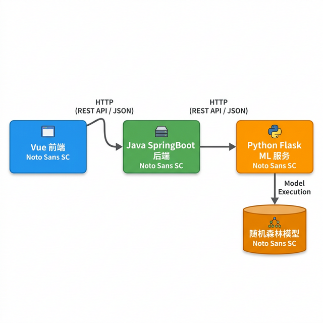

# 文件类型识别系统

日常工作中经常会遇到文件后缀名被篡改或丢失的情况——比如下载的文件没有后缀、邮件附件被改名、恶意文件伪装成图片等。这时候光看文件名根本判断不了真实类型。本项目基于随机森林（Random Forest）机器学习算法，通过分析文件的二进制特征来识别文件真实类型，支持 50 种常见文件格式的识别，前端上传文件后自动返回预测结果。

## 痛点与目的

- **问题**：文件后缀名可以被随意修改或删除，无法通过文件名判断真实类型，存在安全隐患
- **方案**：提取文件二进制魔数和字节分布特征，用随机森林分类器训练识别模型，结合 filetype 库进行双重验证
- **效果**：上传任意文件即可识别真实类型，识别准确率达到较高水平

## 系统界面


### 系统架构



## 核心功能

- **50 种文件类型识别**：覆盖文档（.txt/.docx/.pdf）、图片（.jpg/.png/.bmp）、音视频（.mp3/.mp4/.avi）、压缩包（.zip/.rar）等主流格式
- **随机森林分类器**：100 棵决策树集成预测，基于文件字节分布特征进行分类
- **前后端分离架构**：Java 后端处理业务逻辑，Python Flask 提供机器学习推理服务，Vue 前端展示结果
- **双重验证**：随机森林预测结果与 filetype 库检测结果交叉验证

## 技术架构

```
Vue 前端 (file-type-front/)
    ↓ HTTP
Java SpringBoot 后端 (demo/)
    ↓ REST API (port 5001)
Python Flask ML 服务 (RandomForestModel/)
    ↓
随机森林分类器 → 文件类型预测
    ↓
filetype 库 → 真实类型检测
```

## 使用方法

### 1. 启动 Python ML 服务

```bash
cd RandomForestModel
pip install flask scikit-learn filetype
python app.py
```

ML 服务运行在 `http://localhost:5001`

### 2. 启动 Java 后端

```bash
cd demo
mvn spring-boot:run
```

### 3. 启动 Vue 前端

```bash
cd file-type-front
npm install
npm run serve
```

## 项目结构

```
.
├── file-type-front/                 # Vue 前端
│   └── src/                         # 前端源码
├── demo/                            # SpringBoot 后端
│   ├── src/                         # Java 源码
│   └── pom.xml                      # Maven 依赖
└── RandomForestModel/               # Python ML 服务
    ├── app.py                       # Flask 推理接口
    ├── model_training.py            # 模型训练脚本
    ├── Randomly_generate_data_sets.py  # 数据集生成
    └── Test_prediction.py           # 测试预测脚本
```

## 适用场景

- 文件安全检测（识别伪装文件）
- 未知文件类型判断
- 数字取证分析
- 机器学习在文件分析中的应用学习

## 技术栈

| 组件 | 技术 |
|------|------|
| 前端 | Vue + Element UI |
| 后端 | SpringBoot |
| ML 服务 | Python Flask + scikit-learn |
| 分类算法 | 随机森林（100棵决策树） |
| 文件检测 | filetype 库 |

## 许可证

MIT 许可证
